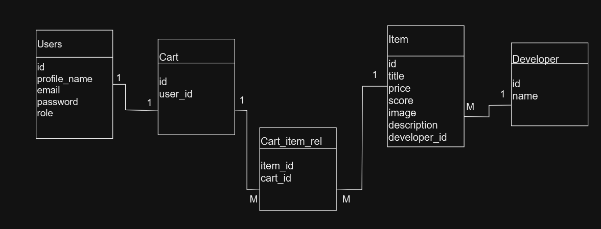

## GSteam

REST-service for selling video games powered on Flask framework.
___

### Requirements

+ Docker and Docker-Compose
+ Python 3.9+
+ PostgreSQL
___

### Quick start

1) Rename `.env.example` to `.env` at the same time substituting data that is valid for you;
2) Rename `.env.db.example` to `.env.db` also performing data substitution;
3) Run `docker-compose up`.
___

### Database scheme

Relationships:
+ *Developer* and *Item*: **One-to-Many**
+ *Consumer* and *Cart*: **One-to-One**
+ *Cart* and *Cart_items*: **One-to-Many**
+ *Item* and *Cart_items*: **One-to-Many**
